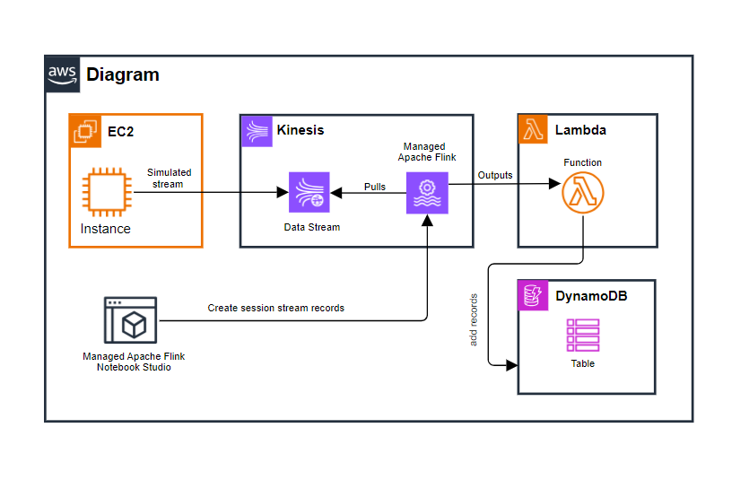
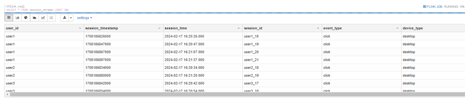

## Introduction:


The application creates a pipeline to transform event stream data, perform analysis on the data and load it into a database,  The cloud services used in the application include:

   - Amazon Kinesis to create the data pipeline for ingesting incoming streaming events from a data source.
   - Managed Service for Apache Flink to perform real-time analysis using SQL on Kinesis Data Streams.
   - AWS Lambda Function to adds records to an Amazon DynamoDB Database.


## Architecture Diagram:




### Tips:

1. The event streams are simulated by a bash shell script `data_simulator.sh`, which is executed from an `EC2 instance`. It puts records into Amazon Kinesis to simulate a streaming data source. Each event representes a website click and includes user ID, click type and the timestamp fields. The records are following the `JSON` format:
    
```json
                {
                  "user_id": "$USER_ID",
                  "event_timestamp": "$EVENT_TIMESTAMP",
                  "event_name": "$EVENT_NAME",
                  "event_type": "click",
                  "device_type": "desktop"
                }
```


2. Apache Flink helps to create `tables` and `analytics` on the Kenisis data stream using `SQL`.


3. `session_stream.sql` file contains SQL code to create user sessions from the generated data, based on a time boundary of `10 seconds`. We consider a user to be in a new session if the difference of `event_timestamp` between his just last event_timestamp is more than 10 seconds:
            - `new_session` is set to 1, indicating the start of a new session, 
            - `new_session` is set to 0, indicating that the event is a continuation of an existing session.
			
            
4. Also in `session_stream.sql`, the `session_id` is defined as the combination of `user_id` and the summation of all `new_session` values of that user (hence partition by user_id in code).
For each user, if a new event represente a new session (`new_session` equal to `1`), the `sum(new_session)` value is incremented by `1`. This ensures that the `session_id` value is unique in **session_stream** table.


5. In the final step, lambda function is created and configured with kinesis trigger to process kinesis click stream records and store them into a dynamoDB Table.


<br>

*Examples of records:*



